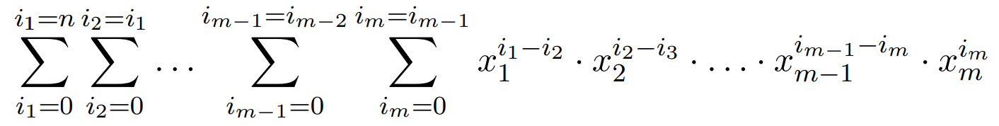
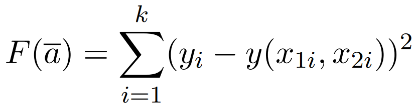
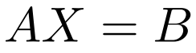
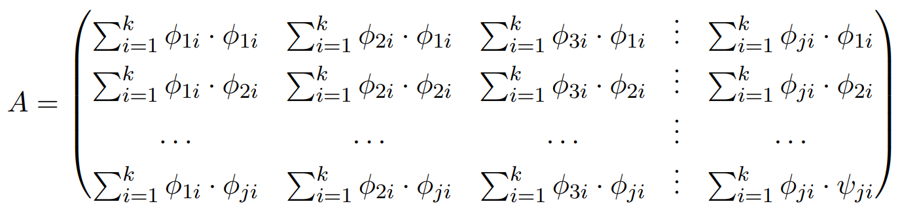
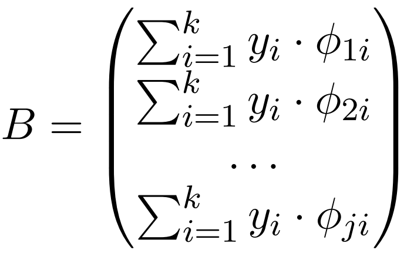
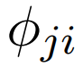
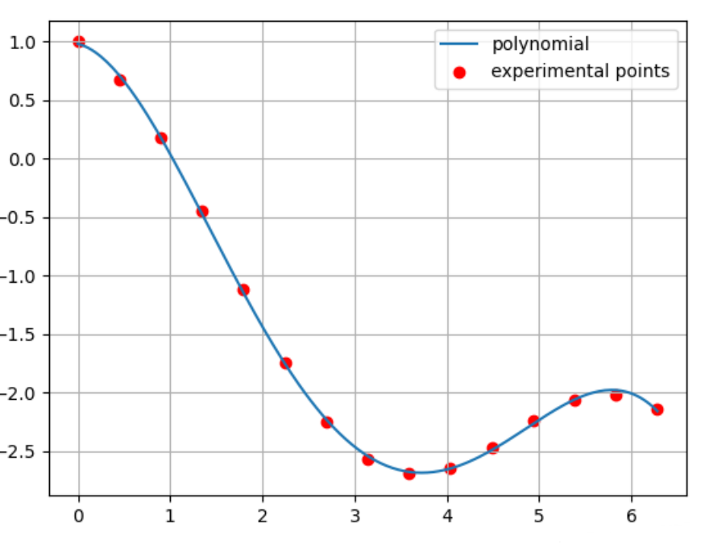
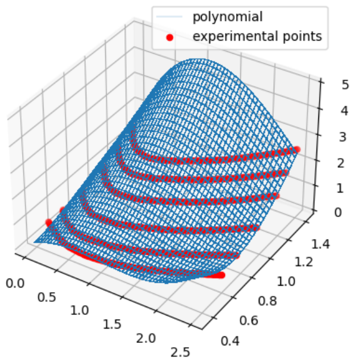

# MSE_approximation
 Approximation of data by polynomial n degrees of m variables 
 
## Overview

<p align="justify"> 
In this project, an algorithm for approximating a polynomial of n degree, m variables, by k points using the least squares method is implemented.

The presented algorithm is recursive. For its implementation, the polynomial is presented in the following form:
</p>

<p align="center"> 
  
</p>

<p align="justify"> 
The task is to minimization of the sum of the difference of squares, selection of parameters a
</p>

<p align="center"> 
  
</p>

<p align="justify"> 
After transformations, the problem is reduced to solving the system of equations - . Where A and B:
</p>

<p align="center"> 
   
</p>

<p align="justify"> 
and  is the product of the arguments of the polynomial with the j-th coefficient at the i-th point.
</p>

## Dependencies
Python 3.7+.<br/>

## Installation
Clone this repo
```bash
git clone https://github.com/DmitriyKhudiakov/MSE_approximation.git
```
Install libs
```bash
pip install numpy
pip install matplotlib
pip install regex
```

## Usage
Examples of working with written functions can be found in example_XXX.py. This algorithm allows you to approximate data in any dimension. Approximation of the functions of the second and third dimensions are presented in the figure below. Approximation of the boston-housing house value dataset by the polynomial of the first
degree (linear regression) shows RMSE = 3.287.

<p align="center"> 
                
</p>

Run examples
```bash
example_001.py
example_002.py
example_003.py
```
The description of the algorithm is given in the file - description.pdf


## License
[MIT](https://choosealicense.com/licenses/mit/)

